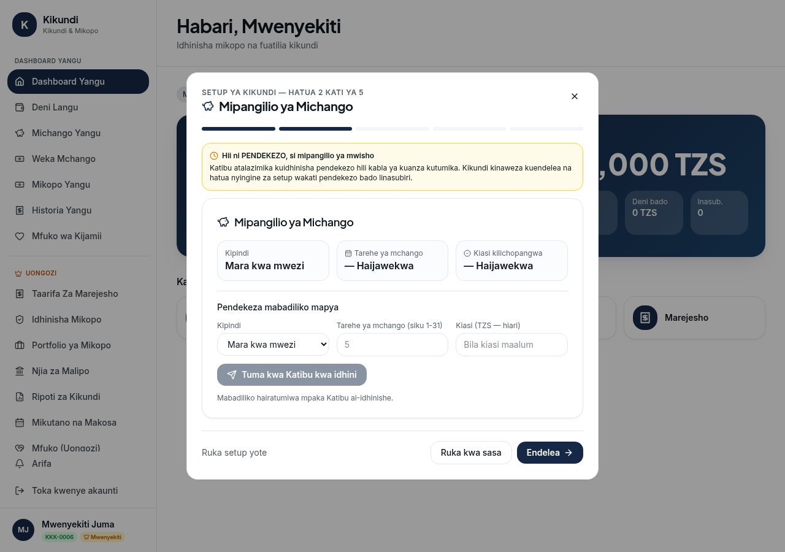
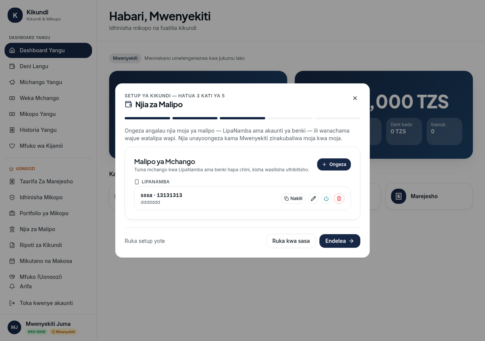
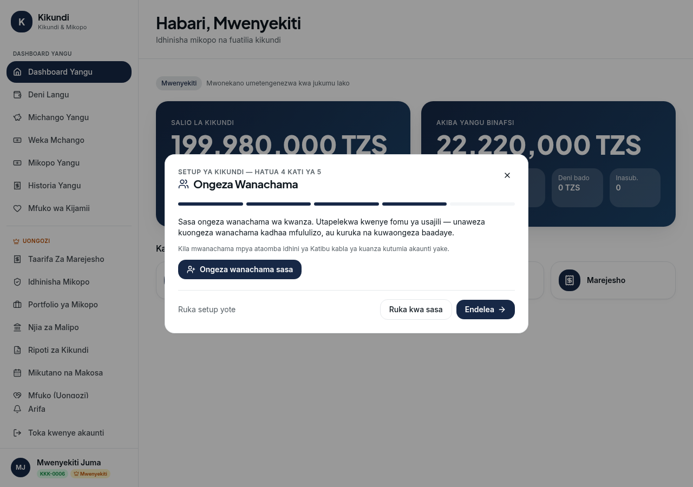
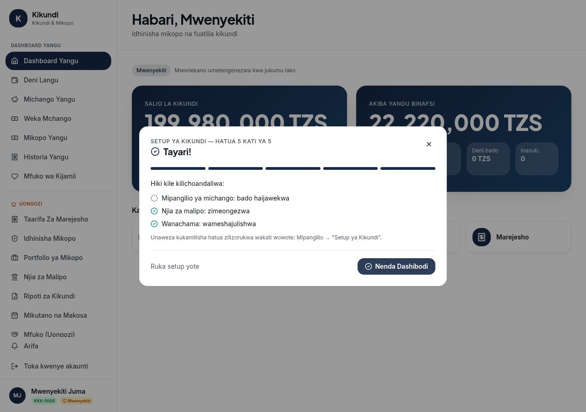
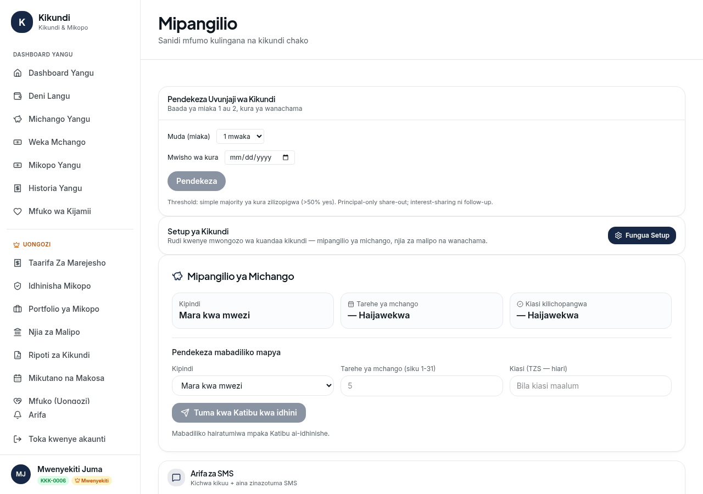
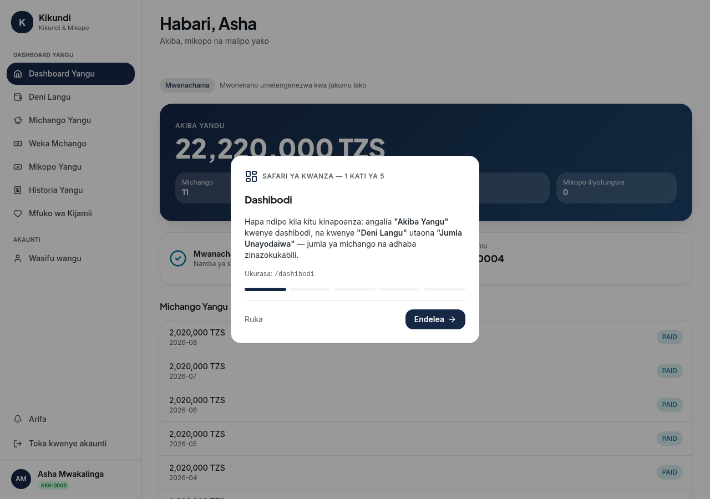
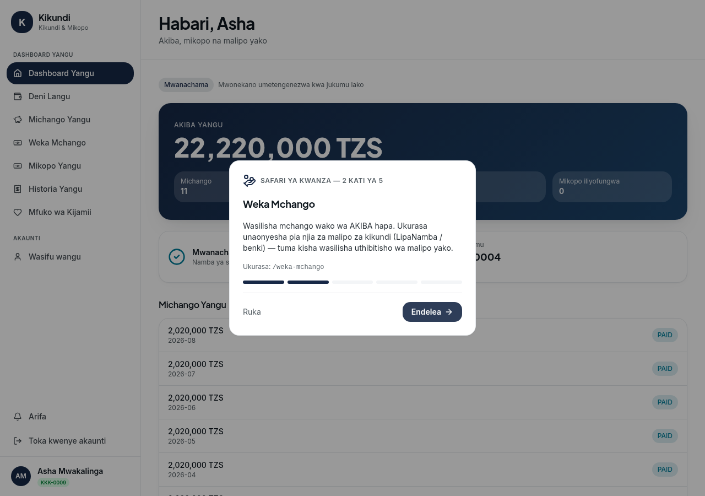
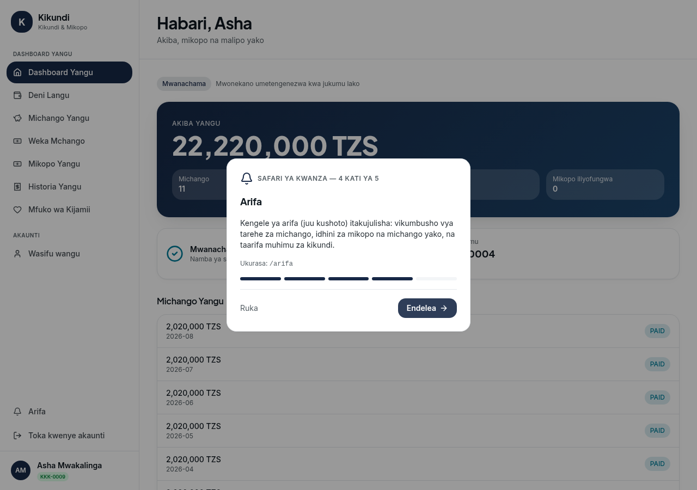

# Onboarding: Mwenyekiti Setup Wizard + New Member App Tour

Full-stack onboarding for the two first-time user types:

1. **Mwenyekiti** setting up a kikundi for the first time → a 5-step guided setup wizard
2. **Newly-approved member** logging in for the first time → a short 5-slide app tour

Both flows are **guidance, not a gate** — every step is skippable and normal navigation is never blocked.

---

## Backend

### Flags (AutoMigrate adds both columns; both default to the "not yet" state)

| Flag | Model | Purpose |
|---|---|---|
| `onboarding_completed` (bool, default false) | `models.Group` | Gates whether the wizard auto-opens on chair login |
| `onboarding_seen` (bool, default false) | `models.User` | Gates whether the member tour auto-shows (once) |

### Endpoints (handlers/onboarding.go — no business logic duplicated)

| Endpoint | Guard | Purpose |
|---|---|---|
| `GET /api/v1/groups/:id/onboarding-status` | any authenticated | Wizard resume payload: `{ onboarding_completed, steps: { contribution_proposed, contribution_approved, payment_method_added, members_added } }` — computed from live data (pending proposal, approved settings, payment-method count, member count) so the wizard resumes correctly mid-way |
| `PATCH /api/v1/groups/:id/onboarding-complete` | chair only (`RequireRoles(RoleChair)`) | Marks the wizard finished **or skipped** — stops auto-opening |
| `PATCH /api/v1/members/:id/onboarding-seen` | self (or admin) | Marks the app tour as seen for the member's linked user |

### Deliberately NOT built

The wizard steps reuse the **existing** endpoints — contribution-settings propose (`POST /groups/:id/contribution-settings/propose`), payment-method creation (`POST /groups/:id/payment-methods`), member creation (`POST /members`). The wizard is a guided UI sequence over existing functionality.

### Tests

`handlers/onboarding_test.go` (real Postgres test DB, `DB_NAME=kikundi_test`):
- status payload shape on a fresh group + chair-only completion + 404 on foreign group id
- tour flag: self can set it, another member gets 403, unknown id → 404, flag persists

---

## Frontend

### Files

| File | Role |
|---|---|
| `src/api/onboarding.ts` | typed API + localStorage progress helpers |
| `src/components/OnboardingWizard.tsx` | 5-step wizard; **reuses** `ContributionSettingsCard` (step 2) and `PaymentMethodsCard` (step 3) verbatim — zero duplicated form logic; step 4 is a shortcut into the existing `/wanachama` creation flow |
| `src/components/OnboardingTour.tsx` | 5-slide orientation tour (no required actions) |
| `src/components/OnboardingGate.tsx` | decides what to show from auth state; also listens for the "Setup ya Kikundi" re-open event |
| `src/routes/__root.tsx` | mounts `<OnboardingGate />` (overlay sibling of `<Outlet />` — never blocking) |
| `src/routes/mipangilio.tsx` | "Setup ya Kikundi" card (chair only) to revisit/finish skipped steps |

### Wizard behaviour

- Auto-opens for a chair of a group with `onboarding_completed=false`; **never** auto-opens again after completion or skip.
- Resume: client-side progress (localStorage) + confirmed against `onboarding-status`; a fresh group starts at "Karibu", a partly-set-up group jumps to the first incomplete step.
- Step 2 copy makes explicit that contribution settings are a **PROPOSAL** pending Katibu approval, and the group can continue other setup while it's pending.
- Step 5 shows an accurate summary ("Mipangilio ya michango: inasubiri idhini ya Katibu" / "Njia za malipo: zimeongezwa" / …).
- "Ruka kwa sasa" on every step + "Ruka setup yote" always available; closing the wizard midway keeps the flag false so it resumes next login.
- After completion (or skip), the "Setup ya Kikundi" link on /mipangilio re-opens it on demand.

### Tour behaviour

- Auto-shows **once** for an approved member with `onboarding_seen=false`: Dashibodi (Akiba Yangu / Jumla Unayodaiwa) → Weka Mchango → Historia Yangu → Arifa → Mfuko wa Kijamii.
- "Ruka" on every step; "Sawa, nimeelewa" finishes. Completion/skip PATCHes `onboarding-seen`; even if that request fails the tour hides (never traps the member).
- Nothing to revisit — there is no incomplete state to return to.

### Tests (vitest + testing-library, `src/components/__tests__/`)

- `onboarding-wizard.test.tsx` (7): chair with flag=false sees the wizard; flag=true does not (but re-opens via the Setup event); resumes at the saved localStorage step; resumes at the first incomplete step the server reports; skip-all calls `onboarding-complete`, clears progress and closes; non-chairs never see it.
- `onboarding-tour.test.tsx` (6): tour advances through all 5 steps; finish and skip both PATCH `onboarding-seen` and close; hides even when the PATCH fails; gate shows it only when `onboarding_seen=false`; never blocks navigation.

Full suites: **159/159** frontend tests pass; backend `go vet` clean + onboarding tests green.

---

## Screenshots

### Part 1 — Mwenyekiti setup wizard (auto-opens on first chair login)

| | |
|---|---|
|  |  |
| Step 2: Mipangilio ya Michango — reuses the propose form, proposal clearly flagged as "PENDEKEZO" | Step 3: Njia za Malipo — reuses the existing payment-methods management card |
|  |  |
| Step 4: Ongeza Wanachama — shortcut into the existing creation flow | Step 5: Tayari! — live summary of configured vs pending items |

Re-entry point after skipping — "Setup ya Kikundi" on /mipangilio:

### Part 2 — New member app tour (once, on first member login)

| | |
|---|---|
|  |  |
| Slide 1: Dashibodi — Akiba Yangu / Jumla Unayodaiwa | Slide 2: Weka Mchango |
|  | |
| Slide 4: Arifa (bell + alert types) | |

(Screenshots captured against the running dev stack; images in `docs/onboarding/`.)

---

## Notes

- Visual style reuses the existing `card-surface` cards, primary buttons and Swahili copy — no new visual language.
- Single-group deployment: tenant checks reuse `database.IsCurrentGroup`.
- Pre-existing unrelated failures observed in the environment: `TestCommitteeReviewFlow` (fails on `main` too) and pre-existing tsc/eslint findings in untouched files.
